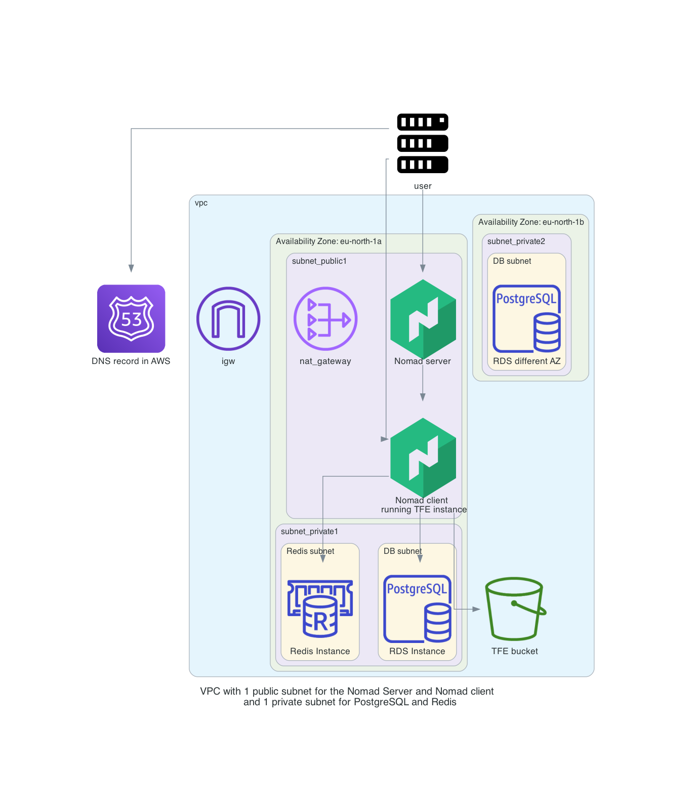
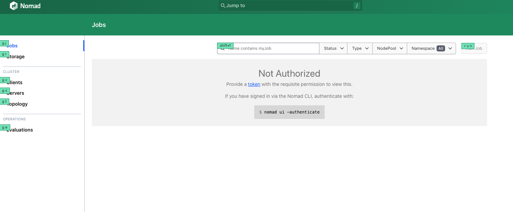
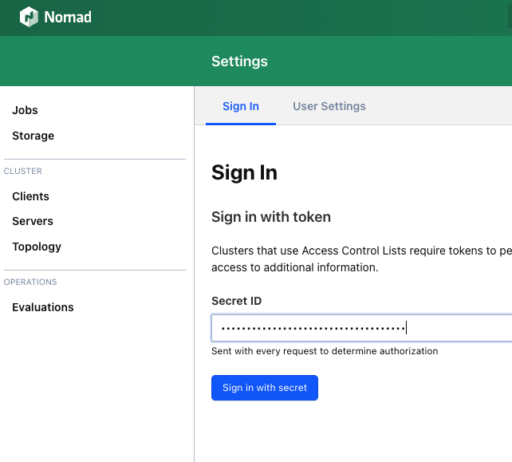
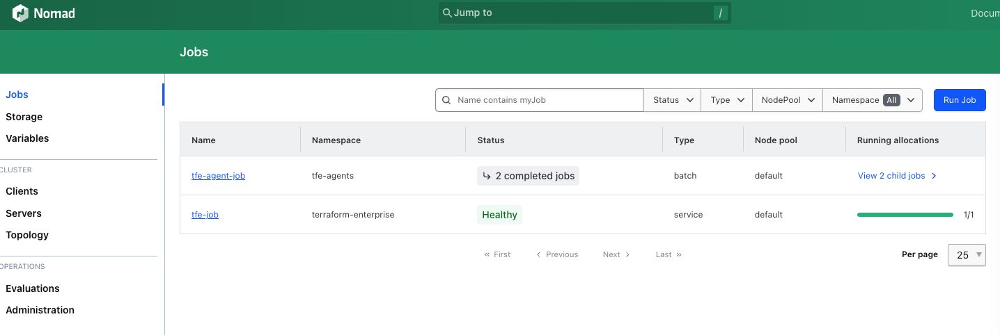

# TFE FDO Nomad on AWS
Install Terraform Enterprise on Nomad with Redis + S3 + DB from AWS as an active-active installation

This repository is based on the following repositories

- Terraform Enterprise FDO with docker single instance from [here](https://github.com/munnep/tfe_next_aws_external)
- The nomad getting started tutorial from [here](https://developer.hashicorp.com/nomad/tutorials/get-started/gs-start-a-cluster)

This code will create a Nomad Server and Nomad client on which we will deploy Terraform Enterprise FDO

- Create an instance with Nomad Server
- Create an instance with Nomad client
- Create S3 buckets used for TFE
- Generate TLS certificates with Let's Encrypt to be used by TFE
- Create a VPC network with subnets, security groups, internet gateway
- Create a RDS PostgreSQL to be used by TFE
- Create a Redis database

# Diagram

Detailed Diagram of the environment:  


# Prerequisites

## License
Make sure you have a TFE license available for use

## AWS
We will be using AWS. Make sure you have the following
- AWS account  
- Install AWS cli [See documentation](https://docs.aws.amazon.com/cli/latest/userguide/install-cliv2.html)

## Install terraform  
See the following documentation [How to install Terraform](https://learn.hashicorp.com/tutorials/terraform/install-cli)

## TLS certificate
You need to have valid TLS certificates that can be used with the DNS name you will be using to contact the TFE instance.  
  
The repo assumes you have no certificates and want to create them using Let's Encrypt and that your DNS domain is managed under AWS. 

# How to

## Build TFE active/active environment
- Clone the repository to your local machine
```sh
git clone https://github.com/munnep/tfe_aws_fdo_nomad.git
```
- Go to the directory
```sh
cd tfe_aws_fdo_nomad
```
- Set your AWS credentials
```sh
export AWS_ACCESS_KEY_ID=
export AWS_SECRET_ACCESS_KEY=
export AWS_SESSION_TOKEN=
```
- create a file called `variables.auto.tfvars` with the following contents and your own values. Example will create 2 TFE nodes at the start.  
```hcl
tag_prefix                 = "tfe26"                                    # TAG prefix for names to easily find your AWS resources
region                     = "eu-north-1"                               # Region to create the environment
vpc_cidr                   = "10.221.0.0/16"                            # subnet mask that can be used 
rds_password               = "Password#1"                               # password used for the RDS environment
dns_hostname               = "tfe26"                                    # DNS hostname for the TFE
dns_zonename               = "aws.munnep.com"                           # DNS zone name to be used
tfe_password               = "Password#1"                               # TFE password for the dashboard and encryption of the data
certificate_email          = "patrick.munne@hashicorp.com"              # Your email address used by TLS certificate registration
public_key                 = "ssh-rsa AAAAB3Nzf"                        # The public key for you to connect to the server over SSH
tfe_active_active          = true                                       # TFE instance setup of active/active - false to start with
tfe_license                = "<your_license>"                           # license key for TFE as string
tfe_release                = "v202406-1"                                # version of TFE you want to install
nomad_version              = "1.8.1"                                    # version of nomad server/client to be installed
```
- Terraform initialize
```sh
terraform init
```
- Terraform plan
```sh
terraform plan
```
- Terraform apply
```sh
terraform apply
```
- Terraform output should create 42 resources and show you the public dns string you can use to connect to the TFE instance
```sh
Plan: 42 to add, 0 to change, 0 to destroy.

Outputs:
port_forwarding_nomad_portal = "ssh -L 4646:localhost:4646 ubuntu@54.154.96.155"
ssh_nomad_client = "ssh ubuntu@54.154.96.155"
ssh_nomad_server = "ssh ubuntu@54.154.96.155"
tfe_appplication = "https://tfe26.aws.munnep.com"
```
- Get your nomad credential from the nomand server by connection using `ssh_nomad_server`
```
ubuntu@ip-10-221-1-23:~$ sudo su -
root@ip-10-221-1-23:~# echo $NOMAD_TOKEN
02d98a8b-3585-3ea1-b64a-se3fdzdf2f                   <-- token to use
```
- to login to the nomad portal make use of the `port_forwarding_nomad_portal` command from the previous to build a tunnel
- On your local machine open a browser to [http://localhost:4646](http://localhost:4646)  
  
- Use the nomad token to authenticate    
  
- Verify the jobs for Terraform enterprise and the agent are deployed. This could take 10 minutes for full deployment because of health checks that need to pass from Nomad side  
  
- Terraform Enterprise should be deployed and you can login using the username `admin` and the password you specified on your variables


## testing

- Go to the directory test_code
```sh
cd test_code
```
- login to your terraform environment just created
```sh
terraform login tfe26.aws.munnep.com
```
- Edit the `main.tf` file with the hostname of your TFE environment
```hcl
terraform {
  cloud {
    hostname = "tfe26.aws.munnep.com"
    organization = "test"

    workspaces {
      name = "test"
    }
  }
}
```
- Run terraform init
```sh
terraform init
```
- run terraform apply
```sh
terraform apply
```
output
```sh
Plan: 1 to add, 0 to change, 0 to destroy.


Do you want to perform these actions in workspace "test-agent"?
  Terraform will perform the actions described above.
  Only 'yes' will be accepted to approve.

  Enter a value: yes

terraform_data.test: Creating...
terraform_data.test: Creation complete after 0s [id=de1c6969-e277-26f1-5434-9020b03ed3fd]

Apply complete! Resources: 1 added, 0 changed, 0 destroyed.
```


